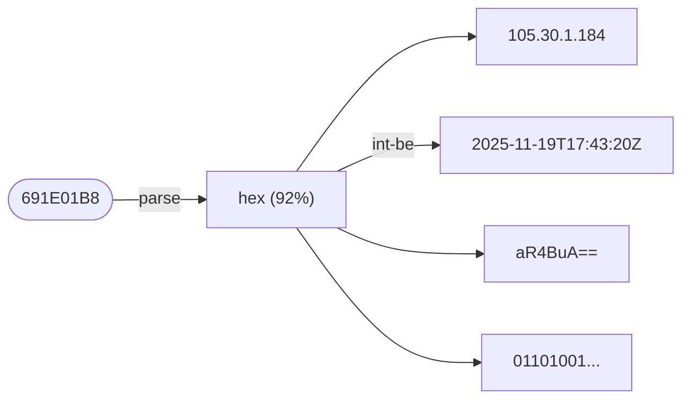

<p align="center">
  
</p>

# forb

**Binary to human, instantly.** A CLI tool that automatically detects and converts data between formats.

```
$ forb 691E01B8

▶ hex (92% confidence)
  4 bytes
  → ipv4: 105.30.1.184
  → epoch-seconds: 2025-11-19T17:43:20+00:00
  ≈ binary: 01101001 00011110 00000001 10111000
  ≈ base64: aR4BuA==
  ≈ int-be: 1763574200
  … (8 more, use -l 0 to show all)
```

Conversions are sorted by usefulness - structured data (JSON, MessagePack, Protobuf) first, then semantic types (datetime, UUID, IP), then encodings. Structured data is pretty-printed with syntax highlighting.



## Why forb?

Ever paste a blob of hex into a dozen different tools trying to figure out what it is? `forb` does it all at once. It tries every interpretation and shows you what makes sense.

- **Hex dump from a debugger?** See it as integers, timestamps, base64
- **Random UUID in logs?** Instantly see which version and extract the timestamp
- **Timestamp that could be seconds or milliseconds?** See both interpretations
- **Space-separated hex bytes?** Just paste them directly

## Installation

### Homebrew (macOS/Linux)

```bash
brew tap mjukis-ab/tap
brew install forb
```

### Scoop (Windows)

```powershell
scoop bucket add mjukis https://github.com/mjukis-ab/scoop-bucket
scoop install forb
```

### Cargo (Rust)

```bash
cargo install formatorbit-cli
```

### Debian/Ubuntu

Download the `.deb` from [GitHub Releases](https://github.com/mjukis-ab/formatorbit/releases), then:

```bash
sudo dpkg -i forb_*.deb
```

### From Source

```bash
git clone https://github.com/mjukis-ab/formatorbit
cd formatorbit
cargo build --release
# Binary is at target/release/forb
```

### Pre-built Binaries

Download from [GitHub Releases](https://github.com/mjukis-ab/formatorbit/releases).

## Usage

### Direct Input

```bash
# Hex (multiple formats supported)
forb 691E01B8
forb 0x691E01B8
forb "69 1E 01 B8"
forb "69:1E:01:B8"
forb "{0x69, 0x1E, 0x01, 0xB8}"

# Base64
forb aR4BuA==

# Timestamps
forb 1703456789
forb 2024-01-15T10:30:00Z

# UUIDs
forb 550e8400-e29b-41d4-a716-446655440000

# IP addresses
forb 192.168.1.1
forb "::1"

# Coordinates
forb "59.3293, 18.0686"
forb "40° 26' 46\" N, 79° 56' 55\" W"
forb u6sce
forb 9FFW83PH+X9

# Colors
forb '#FF5733'
forb 0x80FF5733

# MAC addresses
forb "00:1A:2B:3C:4D:5E"
forb "001A.2B3C.4D5E"

# Cron expressions
forb "*/5 * * * *"
forb "0 2 * * MON-FRI"

# URLs (with tracking removal)
forb "https://example.com/page?utm_source=ads&id=123"
```

### Pipe Mode

Pipe logs through `forb` to automatically annotate interesting values:

```bash
cat server.log | forb
```

```
[2024-01-15 10:30:45] User 550e8400-e29b-41d4-a716-446655440000 logged in
                           ↳ uuid: UUID v4 (random) → hex: 550E8400E29B41D4A716446655440000

[2024-01-15 10:30:46] Received payload: 69 1E 01 B8
                                        ↳ hex: 4 bytes → int-be: 1763574200, epoch: 2025-11-19T17:43:20Z
```

#### Pipe Mode Options

```bash
# Lower threshold to catch more matches (default: 0.8)
cat logs.txt | forb -t 0.5

# Highlight matched values inline
cat logs.txt | forb -H

# Only look for specific formats
cat logs.txt | forb -o uuid,hex,ts

# JSON output for scripting
cat logs.txt | forb -j
```

### Output Options

```bash
# Human-readable (default, shows top 5 conversions)
forb 691E01B8

# Show more/fewer conversions
forb 691E01B8 -l 10    # Show top 10
forb 691E01B8 -l 0     # Show all

# Compact output (single-line JSON/protobuf)
forb 691E01B8 -c

# Disable colors (for piping to files)
forb 691E01B8 -C

# JSON for scripting
forb 691E01B8 --json

# Raw output (just values, for scripting)
forb 691E01B8 -r -1 -l 1

# Show only highest-confidence interpretation
forb 691E01B8 -1

# Force specific format
forb -f hex 1234

# Packet layout for binary formats (protobuf, msgpack)
forb "08 96 01" -p           # Compact inline: [08:tag₁][96 01:150]
forb "08 96 01" -p detailed  # Table with offsets/lengths

# List all supported formats
forb --formats
```

### Graph Output

Visualize the conversion graph:

```bash
# Graphviz DOT format (pipe to dot to render)
forb --dot 691E01B8 | dot -Tpng > graph.png

# Mermaid format (renders in GitHub/GitLab markdown)
forb --mermaid 691E01B8
```

## Supported Formats

| Category | Formats |
|----------|---------|
| **Encoding** | hex, base64, binary, octal, url-encoding, escape sequences (`\x48`, `\u0048`) |
| **Hashing** | MD5, SHA-1, SHA-256, SHA-512 (detection by length) |
| **Numbers** | decimal, binary, octal, data sizes (`1MB`, `1MiB`), temperature (`30°C`, `86°F`) |
| **Math** | Expression evaluation (`2 + 2`, `0xFF + 1`, `1 << 8`, `0b1010 \| 0b0101`, `USD(100)`) |
| **Units** | length, weight, volume, speed, pressure, energy, angle, area (with SI prefixes) |
| **Currency** | `100 USD`, `$50`, `5kEUR`, `2.5MSEK` (with live exchange rates) |
| **Time** | Unix epoch (sec/ms), Apple/Cocoa, Windows FILETIME, ISO 8601, durations (`1h30m`), cron (`*/5 * * * *`) |
| **Identifiers** | UUID (v1-v8 detection), ULID (with timestamp), NanoID, CUID2, JWT |
| **Network** | IPv4, IPv6, MAC address (with OUI vendor lookup) |
| **Web** | URL parsing (with tracking parameter removal) |
| **Coordinates** | Decimal degrees, DMS, DDM, Geohash, Plus Code, UTM, MGRS, SWEREF 99 |
| **Colors** | #RGB, #RRGGBB, rgb(), rgba(), hsl(), hsla(), 0xAARRGGBB (Android) |
| **Data** | JSON, MessagePack, Protobuf (schema-less), plist (XML/binary), UTF-8 |

### Hex Input Styles

`forb` accepts hex in many common formats:

```
691E01B8                    Continuous
0x691E01B8                  With 0x prefix
69 1E 01 B8                 Space-separated (hex dumps)
69:1E:01:B8                 Colon-separated (MAC address)
69-1E-01-B8                 Dash-separated
0x69, 0x1E, 0x01, 0xB8      Comma-separated
{0x69, 0x1E, 0x01, 0xB8}    C/C++ array style
```

### Binary Input Styles

`forb` accepts binary in these formats:

```
0b10101010                  With 0b prefix (standard)
0b1010_1010                 With underscores for readability
%10101010                   Assembly-style % prefix
1010 1010                   Space-separated groups
```

### Format Aliases

For quick filtering with `--only`, formats have short aliases:

| Format | Aliases |
|--------|---------|
| hex | h, x |
| binary | bin, b |
| octal | oct, o |
| base64 | b64 |
| datetime | ts, time, date |
| duration | dur, interval |
| decimal | dec, int, num |
| datasize | size, bytes, filesize |
| expr | expression, math, calc |
| escape | esc, escaped, cstring |
| uuid | guid |
| ulid | - |
| jwt | token |
| hash | md5, sha1, sha256, sha512 |
| ip | ipv4, ipv6 |
| color | col, rgb, argb, hsl |
| json | j |
| protobuf | proto, pb |
| plist | pl |
| url-encoded | url, percent |
| msgpack | mp, mpack |
| currency | cur, money |
| length | len, distance |
| weight | mass, kg, lb |
| volume | vol, liter, gallon |
| speed | velocity |
| pressure | psi, bar, atm |
| energy | joule, calorie, kwh |
| angle | deg, rad |
| area | sqft, sqm |
| temperature | temp, celsius, fahrenheit |
| coords | coordinates, gps, latlon, geo, location, dd, dms, ddm, utm, mgrs, geohash, pluscode |
| mac-address | mac, ethernet, hw-address |
| cron | crontab |
| url-parser | url-parse, link |

## Examples

### Decoding Structured Data

```bash
$ forb "089601120774657374696e67"

▶ hex (92% confidence)
  12 bytes
  → protobuf:
    {
      1: 150 [varint],
      2: "testing" [len]
    }
  → base64: CJYBEgd0ZXN0aW5n
  → binary: 00001000 10010110 00000001 ...
```

With `--packet` mode, see the byte-level structure:

```bash
$ forb "089601120774657374696e67" -p

▶ hex (92% confidence)
  12 bytes
  → protobuf: [08:tag₁][96 01:field 1][12:tag₂][07:len=7][74 65 73 74 69 6e 67:field 2]
```

```bash
$ forb "089601120774657374696e67" -p detailed

▶ hex (92% confidence)
  12 bytes
  → protobuf:
    Offset  Len  Field       Type     Value
    ------  ---  ----------  ------   -----
    0x0000    1  tag₁        tag      field 1, varint
    0x0001    2  field 1     varint   150
    0x0003    1  tag₂        tag      field 2, len
    0x0004    1  len=7       len      "testing"
    0x0005    7    field 2   string   "testing"
```

```bash
$ forb '{"name": "John", "age": 30}'

▶ json (95% confidence)
  JSON object
  → msgpack:
    {
      "age": 30,
      "name": "John"
    }
```

### Debugging Binary Data

```bash
$ forb "69 1E 01 B8"

▶ hex (92% confidence)
  4 bytes (space-separated)
  → ipv4: 105.30.1.184
  → epoch-seconds: 2025-11-19T17:43:20+00:00
  → binary: 01101001 00011110 00000001 10111000
  → base64: aR4BuA==
  … (8 more, use -l 0 to show all)
```

### Identifying UUIDs

```bash
$ forb 550e8400-e29b-41d4-a716-446655440000

▶ uuid (95% confidence)
  UUID v4 (random)
  → ipv6: 550e:8400:e29b:41d4:a716:4466:5544:0
  → hex: 550E8400E29B41D4A716446655440000
  → base64: VQ6EAOKbQdSnFkRmVUQAAA==
```

### Decoding Timestamps

```bash
$ forb 1703456789

▶ decimal (85% confidence)
  Integer: 1703456789
  → epoch-seconds: 2023-12-24T23:06:29+00:00
  → hex: 6588C555
  → binary: 01100101 10001000 11000101 01010101
```

### Analyzing Colors

```bash
$ forb '#FF5733'

▶ color-hex (95% confidence)
  RGB: RGB(255, 87, 51) / HSL(11°, 100%, 60%)
```

```bash
$ forb 'rgb(35, 50, 35)'

▶ color-rgb (95% confidence)
  rgb(): RGB(35, 50, 35) / HSL(120°, 17%, 16%)
  → color-hex: #233223
  → color-hsl: hsl(120, 17%, 16%)
```

### Math Expressions

```bash
$ forb '0xFF + 1'

▶ expr (85% confidence)
  0xFF + 1 = 256
  ≈ hex-int: 0x100
  ≈ binary-int: 0b100000000
  ✓ power-of-2: 2^8
```

### Durations & Data Sizes

```bash
$ forb '1h30m'

▶ duration (90% confidence)
  1h30m = 5400 seconds (2025-12-25T08:00:00Z)
  → datasize-iec: 5.27 KiB
```

```bash
$ forb '1MiB'

▶ datasize (90% confidence)
  1MiB = 1,048,576 bytes (binary)
  → power-of-2: 2^20
  → datasize-si: 1.05 MB
```

### Escape Sequences

```bash
$ forb '\x48\x65\x6c\x6c\x6f'

▶ escape (90% confidence)
  Decoded: "Hello"
  → utf8: Hello
  → hex: 48656C6C6F
```

### Currency Conversion

Exchange rates are fetched from the European Central Bank and cached locally.

```bash
$ forb '100USD'

▶ currency (95% confidence)
  100.00 USD
  → eur: €84.84
  → gbp: £74.06
  → jpy: 15,596 JPY
  → sek: 916.73 SEK
```

SI prefixes work with currency for large amounts:

```bash
$ forb '5kSEK'          # 5,000 SEK
$ forb '2.5MEUR'        # 2.5 million EUR
```

Ambiguous symbols show multiple interpretations:

```bash
$ forb '$100'           # Shows USD, CAD, AUD, etc.
```

### Currency Expression Functions

Use currency codes as functions in expressions to convert amounts to your target currency:

```bash
$ forb --currency SEK 'USD(100)'

▶ expr (50% confidence)
  USD(100) = 922.14
```

Mix currencies in expressions:

```bash
$ forb --currency EUR 'USD(100) + GBP(50)'

▶ expr (75% confidence)
  USD(100) + GBP(50) = 144.23
```

Works with plugin currencies too:

```bash
$ forb 'BTC(0.5)'       # 0.5 BTC in your target currency
```

Target currency is detected automatically from your system locale, or set explicitly:

```bash
# CLI flag (highest priority)
forb --currency EUR "USD(100)"

# Environment variable
FORB_TARGET_CURRENCY=SEK forb "USD(100)"

# Config file (~/.config/forb/config.toml)
# [currency]
# target = "SEK"

# Show current target and available currencies
forb --currency
```

### Unit Conversions

Length, weight, volume, speed, pressure, energy, angle, and area with automatic SI prefix handling:

```bash
$ forb '5km'

▶ length (85% confidence)
  5 km
  ≈ meters-decimal: 5000 m
  ≈ meters: 5000 m
  → feet: 16404.20 ft
  → miles: 3.11 mi
```

```bash
$ forb '150lbs'

▶ weight (85% confidence)
  150 lbs
  → kilograms: 68.04 kg
  → grams: 68038.86 g
```

```bash
$ forb '60mph'

▶ speed (90% confidence)
  60 mph
  → km/h: 96.56 km/h
  → m/s: 26.82 m/s
  → knots: 52.14 knots
```

### Temperature

```bash
$ forb '30C'

▶ temperature (85% confidence)
  30°C (Celsius)
  → fahrenheit: 86°F
  → kelvin: 303.15 K
```

```bash
$ forb '72F'

▶ temperature (85% confidence)
  72°F (Fahrenheit)
  → celsius: 22.22°C
  → kelvin: 295.37 K
```

### Coordinates

Multiple coordinate formats are supported and converted automatically:

```bash
$ forb "59.3293, 18.0686"

▶ coords (90% confidence)
  Decimal Degrees: 59.329300, 18.068600
  ≈ dms: 59° 19' 45.48" N, 18° 4' 6.96" E
  ≈ ddm: 59° 19.7580' N, 18° 4.1160' E
  → geohash: u6sce0t4h
  → plus-code: 9FFW83H9+PC
  → utm: 34V 333230 6580391
  → mgrs: 34VCL3323080391
```

```bash
$ forb "40° 26' 46\" N, 79° 56' 55\" W"

▶ coords (90% confidence)
  Degrees Minutes Seconds: 40.446111, -79.948611
  ≈ dd: 40.446111, -79.948611
  → geohash: dppnhdzpw
  → plus-code: 87G2C3W2+CH
```

```bash
$ forb "u6sce"

▶ coords (90% confidence)
  Geohash (precision 5): 59.348145, 18.083496
  → plus-code: 9FFW83XM+79
  → utm: 34V 333418 6582476
```

### MAC Addresses

```bash
$ forb "00:1A:2B:3C:4D:5E"

▶ mac-address (95% confidence)
  00:1A:2B:3C:4D:5E (Ayecom Technology Co., Ltd.)
  → base64: ABorPE1e
```

Multiple notations are supported:

```bash
forb "00-1A-2B-3C-4D-5E"     # Hyphen-separated
forb "001A.2B3C.4D5E"        # Cisco notation
forb "00 1A 2B 3C 4D 5E"     # Space-separated
```

### Cron Expressions

```bash
$ forb "*/5 * * * *"

▶ cron (90% confidence)
  Every 5 minutes
  Next: 2024-01-15 10:35:00, 2024-01-15 10:40:00, ...
```

```bash
$ forb "0 2 * * *"

▶ cron (90% confidence)
  At 02:00
  Next: 2024-01-16 02:00:00, 2024-01-17 02:00:00, ...
```

### URL Parsing

```bash
$ forb "https://example.com/page?utm_source=google&id=123"

▶ url-parser (85% confidence)
  URL with tracking parameters
  → url-cleaned: https://example.com/page?id=123
```

Tracking parameters (utm_*, fbclid, gclid, etc.) are automatically identified and can be removed.

### Processing Logs

```bash
$ echo '[INFO] Request from 192.168.1.100 with ID 550e8400-e29b-41d4-a716-446655440000' | forb -t 0.5

[INFO] Request from 192.168.1.100 with ID 550e8400-e29b-41d4-a716-446655440000
                    ↳ ipv4: ip: 192.168.1.100, hex: C0A80164
                                               ↳ uuid: UUID v4 (random) → hex: 550E8400E29B41D4A716446655440000
```

## How It Works

### Overview

```
┌─────────────────────────────────────────────────────────────────────────┐
│                              Input: "691E01B8"                          │
└─────────────────────────────────────────────────────────────────────────┘
                                      │
                                      ▼
┌─────────────────────────────────────────────────────────────────────────┐
│  1. PARSING: Try all format parsers, each returns confidence score      │
│     • HexFormat.parse() → 92% (valid hex, has letters A-F)              │
│     • DecimalFormat.parse() → 70% (valid number, but very large)        │
│     • Base64Format.parse() → 0% (invalid base64)                        │
└─────────────────────────────────────────────────────────────────────────┘
                                      │
                                      ▼
┌─────────────────────────────────────────────────────────────────────────┐
│  2. INTERPRETATION: Each successful parse produces a CoreValue          │
│     • hex (92%) → CoreValue::Bytes([0x69, 0x1E, 0x01, 0xB8])            │
│     • decimal (70%) → CoreValue::Int(691_801_800)                       │
└─────────────────────────────────────────────────────────────────────────┘
                                      │
                                      ▼
┌─────────────────────────────────────────────────────────────────────────┐
│  3. BFS CONVERSION: For each interpretation, explore conversion graph   │
│     • Bytes → IPv4, integers, base64, hashes, text...                   │
│     • Int → epoch timestamp, hex notation, binary notation...           │
│     • String → reinterpret as UUID, IP, JSON, datetime...               │
└─────────────────────────────────────────────────────────────────────────┘
                                      │
                                      ▼
┌─────────────────────────────────────────────────────────────────────────┐
│  4. OUTPUT: Rank by confidence, sort conversions by priority            │
│     ▶ hex (92%) → ipv4, epoch-seconds, base64, binary...                │
│     ▶ decimal (70%) → epoch-seconds, hex-int, binary-int...             │
└─────────────────────────────────────────────────────────────────────────┘
```

### Core Types

The system is built around three core types:

- **CoreValue**: The internal representation of data. Can be `Bytes`, `String`, `Int`, `Float`, `DateTime`, `Json`, `Coordinates`, `Color`, and various unit types (Length, Weight, etc.)

- **Interpretation**: Result of parsing input. Contains the `CoreValue`, source format ID, confidence score (0.0-1.0), and display description.

- **Conversion**: Result of converting a value. Contains the target `CoreValue`, format ID, display string, conversion path, and metadata (priority, kind, lossy flag).

### Parsing & Confidence

Each format parser analyzes the input and returns a confidence score:

| Confidence | Meaning | Examples |
|------------|---------|----------|
| **90-100%** | Strong structural indicators | `0x` prefix, UUID dashes, base64 `=` padding, JSON braces |
| **70-90%** | Valid format, plausible content | Valid hex chars, reasonable timestamp range, valid IP octets |
| **50-70%** | Ambiguous, could be multiple things | Pure digits (decimal? hex? timestamp?), short strings |
| **<50%** | Weak match, shown as fallback | Plain text interpretation |

Confidence is **dynamic** based on input characteristics. For example, math expressions:
- `5*9*3*9/23` (complex) → 95% confidence
- `5*9` (simple multiply) → 85%
- `2+2` (simple addition) → 75% (lower because `+` appears in dates, URLs)

### BFS Conversion Graph

Conversions are discovered via **breadth-first search** through a graph where:
- **Nodes** are `CoreValue`s
- **Edges** are format conversions

```
                    ┌─────────┐
                    │  Bytes  │
                    └────┬────┘
          ┌──────────────┼──────────────┐
          ▼              ▼              ▼
     ┌─────────┐   ┌──────────┐   ┌──────────┐
     │  Int-BE │   │  Base64  │   │   Text   │
     └────┬────┘   └──────────┘   └────┬─────┘
          │                            │
          ▼                            ▼ (reinterpret)
     ┌─────────┐                  ┌─────────┐
     │ DateTime│                  │  UUID   │
     └─────────┘                  └─────────┘
```

The BFS explores up to 5 levels deep, tracking visited nodes to prevent cycles. Each format's `conversions()` method defines outgoing edges from its value type.

### String Reinterpretation

When a conversion produces a `CoreValue::String`, the BFS **re-parses** that string to discover nested formats:

```bash
$ forb '7b22 6865 6c6c 6f22 3a22 686f 6922 7d'

▶ hex (92% confidence)
  15 bytes (space-separated)
  → json: (via hex → utf8 → json)    # String reinterpretation!
    {
      "hello": "hoi"
    }
```

This enables chains like:
- `hex → utf8 → json` (hex-encoded JSON)
- `hex → utf8 → uuid` (hex-encoded UUID string)
- `hex → utf8 → ipv4` (hex-encoded IP address)
- `base64 → utf8 → json` (base64-encoded JSON)

Controlled by `--reinterpret-threshold` (default: 0.7). Only high-confidence reinterpretations are explored.

### Conversion Kinds

Conversions are categorized by what they represent:

| Symbol | Kind | Description | Example |
|--------|------|-------------|---------|
| `→` | **Conversion** | Actual data transformation | `1703456789` → `2023-12-24T23:06:29Z` |
| `≈` | **Representation** | Same value, different notation | `256` → `0x100` |
| `✓` | **Trait** | Property/observation about the value | `256` → `power-of-2: 2^8` |

### Conversion Priority

Conversions are sorted by usefulness:

1. **Primary** - Direct results (expression evaluation)
2. **Structured** - JSON, MessagePack, Protobuf (pretty-printed)
3. **Semantic** - DateTime, UUID, IP, Color (meaningful types)
4. **Encoding** - Hex, Base64, URL-encoded (format conversions)
5. **Raw** - Integers, bytes, hashes

### Noise Control

The conversion graph can produce excessive results. Noise is controlled via:

**Root-based blocking**: Prevent nonsensical chains based on input type
- Text bytes → IPv4 blocked (ASCII "test" isn't `116.101.115.116`)
- Hex bytes → Color blocked (random hex isn't a color)

**Path-based blocking**: Block specific immediate conversions
- Configurable in `config.toml` via `[blocking]` section

**Confidence threshold**: Only explore high-confidence reinterpretations
- String reinterpretation requires ≥70% confidence by default

Use `-l 0` to show all conversions, or `-l N` to show top N.

## Configuration

Settings can be configured via CLI flags, environment variables, or a config file.

**Precedence:** CLI args > Environment vars > Config file > Defaults

| Setting | CLI flag | Env var | Default |
|---------|----------|---------|---------|
| limit | `-l`, `--limit` | `FORB_LIMIT` | 5 |
| threshold | `-t`, `--threshold` | `FORB_THRESHOLD` | 0.8 |
| reinterpret_threshold | `--reinterpret-threshold` | - | 0.7 |
| no_color | `-C`, `--no-color` | `FORB_NO_COLOR` | false |
| url_timeout | `--url-timeout` | `FORB_URL_TIMEOUT` | 30 |
| url_max_size | `--url-max-size` | `FORB_URL_MAX_SIZE` | 10M |
| target_currency | `--currency` | `FORB_TARGET_CURRENCY` | locale/USD |

```bash
# Show config file location
forb --config-path

# Generate default config file
forb --config-init
```

### Priority & Blocking

Customize which conversions are shown and in what order:

```toml
# ~/.config/forb/config.toml (Linux) or ~/Library/Application Support/forb/config.toml (macOS)

[priority]
# Reorder categories (default: Primary, Structured, Semantic, Encoding, Raw)
category_order = ["Semantic", "Structured", "Primary", "Encoding", "Raw"]

# Adjust individual format priorities
[priority.format_priority]
datetime = 10        # Bump up within category
uuid = 5             # Also bump up, but less
hex = -10            # Push down within category
ipv4 = "Primary"     # Move to different category

[blocking]
# Never show these formats
formats = ["octal", "binary"]

# Block specific conversion paths
paths = ["hex:msgpack", "uuid:epoch-seconds"]
```

Use `--show-paths` to see blockable paths for any input:

```bash
$ forb --show-paths 691E01B8
▶ hex (92% confidence)
  4 bytes
  → ipv4: 105.30.1.184 [hex:ipv4]
  → epoch-seconds: 2025-11-19T17:43:20Z [hex:int-be:epoch-seconds]
```

## Plugins

Extend forb with Python plugins for custom decoders, expression functions, traits, currencies, and more. Requires Python 3.8+ installed on your system.

**Bundled Plugin:** A cryptocurrency plugin (BTC, ETH, SOL rates from CoinGecko) is installed automatically on first run.

```bash
# Try the bundled crypto plugin
forb "1 BTC"            # Shows BTC in USD, EUR, SEK, etc.
forb "100 USD"          # Includes BTC conversion

# Enable more sample plugins
cp sample-plugins/math_ext.py.sample ~/.config/forb/plugins/math_ext.py

# Use plugin functionality
forb "factorial(10)"    # → 3628800
forb "PI * 2"           # → 6.283185307179586
```

**Plugin types:**
- **Decoders** - Parse custom input formats
- **Expression variables** - Add constants like `PI`, `E`, `PHI`
- **Expression functions** - Add functions like `factorial()`, `fib()`, `gcd()`
- **Traits** - Detect properties like "semantic version" or "well-known port"
- **Visualizers** - Custom rich display for GUI applications
- **Currencies** - Custom exchange rates (e.g., cryptocurrencies) with automatic cross-conversion

```bash
# List loaded plugins
forb --plugins

# Show plugin directory
forb --plugins path
```

See [PLUGINS.md](PLUGINS.md) for comprehensive documentation on creating and using plugins.

## Analytics

Local usage tracking helps improve forb. Enabled by default, stored in human-readable TOML.

**Privacy-first design:**
- No input data, filenames, or URLs are ever recorded
- Only aggregate counts: which formats are used, which features, CLI version
- Data stored locally at `~/.config/forb/analytics.toml`
- Disable anytime via `FORB_ANALYTICS=0` or config

```bash
# View analytics status and summary
forb --analytics status

# View full analytics data
forb --analytics show

# Clear all analytics data
forb --analytics clear

# Disable analytics
export FORB_ANALYTICS=0
# Or add to config: [analytics] enabled = false
```

### Anonymous Contribution

Optionally share aggregate usage data to help prioritize development:

```bash
# Preview what would be sent (no network call)
forb --analytics preview

# Send anonymous data
forb --analytics contribute
```

**What's sent:** CLI version, platform, top 10 formats/conversions, feature usage counts. Fresh random ID per contribution (no cross-session tracking).

## License

MIT

## Contributing

Contributions welcome! See [CONTRIBUTING.md](CONTRIBUTING.md) for development setup, testing, and benchmarking. See [CLAUDE.md](CLAUDE.md) for architecture details and coding conventions.
