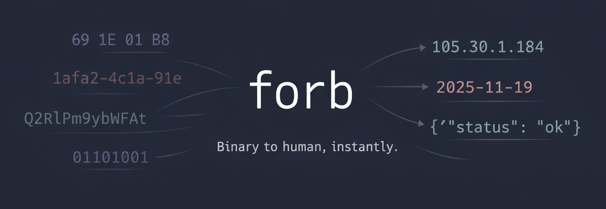

<p align="center">
  
</p>

# forb

**Binary to human, instantly.** A CLI tool that automatically detects and converts data between formats.

```
$ forb 691E01B8

▶ hex (92% confidence)
  4 bytes
  → ipv4: 105.30.1.184
  → epoch-seconds: 2025-11-19T17:43:20+00:00
  → binary: 01101001 00011110 00000001 10111000
  → base64: aR4BuA==
  → int-be: 1763574200
  … (8 more, use -l 0 to show all)
```

Conversions are sorted by usefulness - structured data (JSON, MessagePack, Protobuf) first, then semantic types (datetime, UUID, IP), then encodings. Structured data is pretty-printed with syntax highlighting.


## Why forb?

Ever paste a blob of hex into a dozen different tools trying to figure out what it is? `forb` does it all at once. It tries every interpretation and shows you what makes sense.

- **Hex dump from a debugger?** See it as integers, timestamps, base64
- **Random UUID in logs?** Instantly see which version and extract the timestamp
- **Timestamp that could be seconds or milliseconds?** See both interpretations
- **Space-separated hex bytes?** Just paste them directly

## Installation

### Homebrew (macOS/Linux)

```bash
brew tap mjukis-ab/tap
brew install forb
```

### Scoop (Windows)

```powershell
scoop bucket add mjukis https://github.com/mjukis-ab/scoop-bucket
scoop install forb
```

### Cargo (Rust)

```bash
cargo install formatorbit-cli
```

### Debian/Ubuntu

Download the `.deb` from [GitHub Releases](https://github.com/mjukis-ab/formatorbit/releases), then:

```bash
sudo dpkg -i forb_*.deb
```

### From Source

```bash
git clone https://github.com/mjukis-ab/formatorbit
cd formatorbit
cargo build --release
# Binary is at target/release/forb
```

### Pre-built Binaries

Download from [GitHub Releases](https://github.com/mjukis-ab/formatorbit/releases).

## Usage

### Direct Input

```bash
# Hex (multiple formats supported)
forb 691E01B8
forb 0x691E01B8
forb "69 1E 01 B8"
forb "69:1E:01:B8"
forb "{0x69, 0x1E, 0x01, 0xB8}"

# Base64
forb aR4BuA==

# Timestamps
forb 1703456789
forb 2024-01-15T10:30:00Z

# UUIDs
forb 550e8400-e29b-41d4-a716-446655440000

# IP addresses
forb 192.168.1.1
forb "::1"

# Colors
forb '#FF5733'
forb 0x80FF5733
```

### Pipe Mode

Pipe logs through `forb` to automatically annotate interesting values:

```bash
cat server.log | forb
```

```
[2024-01-15 10:30:45] User 550e8400-e29b-41d4-a716-446655440000 logged in
                           ↳ uuid: UUID v4 (random) → hex: 550E8400E29B41D4A716446655440000

[2024-01-15 10:30:46] Received payload: 69 1E 01 B8
                                        ↳ hex: 4 bytes → int-be: 1763574200, epoch: 2025-11-19T17:43:20Z
```

#### Pipe Mode Options

```bash
# Lower threshold to catch more matches (default: 0.8)
cat logs.txt | forb -t 0.5

# Highlight matched values inline
cat logs.txt | forb -H

# Only look for specific formats
cat logs.txt | forb -o uuid,hex,ts

# JSON output for scripting
cat logs.txt | forb -j
```

### Output Options

```bash
# Human-readable (default, shows top 5 conversions)
forb 691E01B8

# Show more/fewer conversions
forb 691E01B8 -l 10    # Show top 10
forb 691E01B8 -l 0     # Show all

# Compact output (single-line JSON/protobuf)
forb 691E01B8 -c

# Disable colors (for piping to files)
forb 691E01B8 -C

# JSON for scripting
forb 691E01B8 --json

# Raw output (just values, for scripting)
forb 691E01B8 -r -1 -l 1

# Show only highest-confidence interpretation
forb 691E01B8 -1

# Force specific format
forb -f hex 1234

# Packet layout for binary formats (protobuf, msgpack)
forb "08 96 01" -p           # Compact inline: [08:tag₁][96 01:150]
forb "08 96 01" -p detailed  # Table with offsets/lengths

# List all supported formats
forb --formats
```

### Graph Output

Visualize the conversion graph:

```bash
# Graphviz DOT format (pipe to dot to render)
forb --dot 691E01B8 | dot -Tpng > graph.png

# Mermaid format (renders in GitHub/GitLab markdown)
forb --mermaid 691E01B8
```

## Supported Formats

| Category | Formats |
|----------|---------|
| **Encoding** | hex, base64, binary, octal, url-encoding, escape sequences (`\x48`, `\u0048`) |
| **Hashing** | MD5, SHA-1, SHA-256, SHA-512 (detection by length) |
| **Numbers** | decimal, binary, octal, data sizes (`1MB`, `1MiB`), temperature (`30°C`, `86°F`) |
| **Math** | Expression evaluation (`2 + 2`, `0xFF + 1`, `1 << 8`, `0b1010 \| 0b0101`) |
| **Units** | length, weight, volume, speed, pressure, energy, angle, area (with SI prefixes) |
| **Currency** | `100 USD`, `$50`, `5kEUR`, `2.5MSEK` (with live exchange rates) |
| **Time** | Unix epoch (sec/ms), Apple/Cocoa, Windows FILETIME, ISO 8601, durations (`1h30m`) |
| **Identifiers** | UUID (v1-v8 detection), ULID (with timestamp), NanoID, CUID2, JWT |
| **Network** | IPv4, IPv6 |
| **Colors** | #RGB, #RRGGBB, rgb(), rgba(), hsl(), hsla(), 0xAARRGGBB (Android) |
| **Data** | JSON, MessagePack, Protobuf (schema-less), plist (XML/binary), UTF-8 |

### Hex Input Styles

`forb` accepts hex in many common formats:

```
691E01B8                    Continuous
0x691E01B8                  With 0x prefix
69 1E 01 B8                 Space-separated (hex dumps)
69:1E:01:B8                 Colon-separated (MAC address)
69-1E-01-B8                 Dash-separated
0x69, 0x1E, 0x01, 0xB8      Comma-separated
{0x69, 0x1E, 0x01, 0xB8}    C/C++ array style
```

### Binary Input Styles

`forb` accepts binary in these formats:

```
0b10101010                  With 0b prefix (standard)
0b1010_1010                 With underscores for readability
%10101010                   Assembly-style % prefix
1010 1010                   Space-separated groups
```

### Format Aliases

For quick filtering with `--only`, formats have short aliases:

| Format | Aliases |
|--------|---------|
| hex | h, x |
| binary | bin, b |
| octal | oct, o |
| base64 | b64 |
| datetime | ts, time, date |
| duration | dur, interval |
| decimal | dec, int, num |
| datasize | size, bytes, filesize |
| expr | expression, math, calc |
| escape | esc, escaped, cstring |
| uuid | guid |
| ulid | - |
| jwt | token |
| hash | md5, sha1, sha256, sha512 |
| ip | ipv4, ipv6 |
| color | col, rgb, argb, hsl |
| json | j |
| protobuf | proto, pb |
| plist | pl |
| url-encoded | url, percent |
| msgpack | mp, mpack |
| currency | cur, money |
| length | len, distance |
| weight | mass, kg, lb |
| volume | vol, liter, gallon |
| speed | velocity |
| pressure | psi, bar, atm |
| energy | joule, calorie, kwh |
| angle | deg, rad |
| area | sqft, sqm |
| temperature | temp, celsius, fahrenheit |

## Examples

### Decoding Structured Data

```bash
$ forb "089601120774657374696e67"

▶ hex (92% confidence)
  12 bytes
  → protobuf:
    {
      1: 150 [varint],
      2: "testing" [len]
    }
  → base64: CJYBEgd0ZXN0aW5n
  → binary: 00001000 10010110 00000001 ...
```

With `--packet` mode, see the byte-level structure:

```bash
$ forb "089601120774657374696e67" -p

▶ hex (92% confidence)
  12 bytes
  → protobuf: [08:tag₁][96 01:field 1][12:tag₂][07:len=7][74 65 73 74 69 6e 67:field 2]
```

```bash
$ forb "089601120774657374696e67" -p detailed

▶ hex (92% confidence)
  12 bytes
  → protobuf:
    Offset  Len  Field       Type     Value
    ------  ---  ----------  ------   -----
    0x0000    1  tag₁        tag      field 1, varint
    0x0001    2  field 1     varint   150
    0x0003    1  tag₂        tag      field 2, len
    0x0004    1  len=7       len      "testing"
    0x0005    7    field 2   string   "testing"
```

```bash
$ forb '{"name": "John", "age": 30}'

▶ json (95% confidence)
  JSON object
  → msgpack:
    {
      "age": 30,
      "name": "John"
    }
```

### Debugging Binary Data

```bash
$ forb "69 1E 01 B8"

▶ hex (92% confidence)
  4 bytes (space-separated)
  → ipv4: 105.30.1.184
  → epoch-seconds: 2025-11-19T17:43:20+00:00
  → binary: 01101001 00011110 00000001 10111000
  → base64: aR4BuA==
  … (8 more, use -l 0 to show all)
```

### Identifying UUIDs

```bash
$ forb 550e8400-e29b-41d4-a716-446655440000

▶ uuid (95% confidence)
  UUID v4 (random)
  → ipv6: 550e:8400:e29b:41d4:a716:4466:5544:0
  → hex: 550E8400E29B41D4A716446655440000
  → base64: VQ6EAOKbQdSnFkRmVUQAAA==
```

### Decoding Timestamps

```bash
$ forb 1703456789

▶ decimal (85% confidence)
  Integer: 1703456789
  → epoch-seconds: 2023-12-24T23:06:29+00:00
  → hex: 6588C555
  → binary: 01100101 10001000 11000101 01010101
```

### Analyzing Colors

```bash
$ forb '#FF5733'

▶ color-hex (95% confidence)
  RGB: RGB(255, 87, 51) / HSL(11°, 100%, 60%)
```

```bash
$ forb 'rgb(35, 50, 35)'

▶ color-rgb (95% confidence)
  rgb(): RGB(35, 50, 35) / HSL(120°, 17%, 16%)
  → color-hex: #233223
  → color-hsl: hsl(120, 17%, 16%)
```

### Math Expressions

```bash
$ forb '0xFF + 1'

▶ expr (60% confidence)
  0xFF + 1 = 256
  → hex-int: 0x100
  → binary-int: 0b100000000
  → power-of-2: 2^8
```

### Durations & Data Sizes

```bash
$ forb '1h30m'

▶ duration (90% confidence)
  1h30m = 5400 seconds (2025-12-25T08:00:00Z)
  → datasize-iec: 5.27 KiB
```

```bash
$ forb '1MiB'

▶ datasize (90% confidence)
  1MiB = 1,048,576 bytes (binary)
  → power-of-2: 2^20
  → datasize-si: 1.05 MB
```

### Escape Sequences

```bash
$ forb '\x48\x65\x6c\x6c\x6f'

▶ escape (90% confidence)
  Decoded: "Hello"
  → utf8: Hello
  → hex: 48656C6C6F
```

### Currency Conversion

Exchange rates are fetched from the European Central Bank and cached locally.

```bash
$ forb '100USD'

▶ currency (95% confidence)
  100.00 USD
  → eur: €84.84
  → gbp: £74.06
  → jpy: 15,596 JPY
  → sek: 916.73 SEK
```

SI prefixes work with currency for large amounts:

```bash
$ forb '5kSEK'          # 5,000 SEK
$ forb '2.5MEUR'        # 2.5 million EUR
```

Ambiguous symbols show multiple interpretations:

```bash
$ forb '$100'           # Shows USD, CAD, AUD, etc.
```

### Unit Conversions

Length, weight, volume, speed, pressure, energy, angle, and area with automatic SI prefix handling:

```bash
$ forb '5km'

▶ length (85% confidence)
  5 km
  → meters: 5000 m
  → feet: 16404.20 ft
  → miles: 3.11 mi
```

```bash
$ forb '150lbs'

▶ weight (85% confidence)
  150 lbs
  → kilograms: 68.04 kg
  → grams: 68038.86 g
```

```bash
$ forb '60mph'

▶ speed (90% confidence)
  60 mph
  → km/h: 96.56 km/h
  → m/s: 26.82 m/s
  → knots: 52.14 knots
```

### Temperature

```bash
$ forb '30C'

▶ temperature (85% confidence)
  30°C (Celsius)
  → fahrenheit: 86°F
  → kelvin: 303.15 K
```

```bash
$ forb '72F'

▶ temperature (85% confidence)
  72°F (Fahrenheit)
  → celsius: 22.22°C
  → kelvin: 295.37 K
```

### Processing Logs

```bash
$ echo '[INFO] Request from 192.168.1.100 with ID 550e8400-e29b-41d4-a716-446655440000' | forb -t 0.5

[INFO] Request from 192.168.1.100 with ID 550e8400-e29b-41d4-a716-446655440000
                    ↳ ipv4: ip: 192.168.1.100, hex: C0A80164
                                               ↳ uuid: UUID v4 (random) → hex: 550E8400E29B41D4A716446655440000
```

## How It Works

1. **Parse**: Try all format parsers on the input
2. **Rank**: Sort interpretations by confidence score
3. **Convert**: For each interpretation, find all possible conversions via graph traversal
4. **Prioritize**: Sort conversions by usefulness (structured data first, then semantic types, then encodings)
5. **Display**: Show results with the most likely interpretation first, limited to top 5 conversions by default

**Confidence score** (0-100%) indicates how likely each interpretation is:
- **90%+**: Strong indicators (0x prefix, UUID dashes, base64 padding)
- **70-90%**: Plausible match (valid hex chars, reasonable timestamp range)
- **<70%**: Possible but less certain

**Conversion priority** - most useful conversions shown first:
1. Structured data (JSON, MessagePack, Protobuf - pretty-printed with colors)
2. Semantic types (datetime, UUID, IP address, color)
3. Encodings (hex, base64, url-encoded)
4. Raw values (integers, bytes)

**Conversion kinds** - different types of output:
- **Conversions**: Actual data transformations (bytes → integer, epoch → datetime)
- **Representations**: Same value in different notation (1024 → 0x400, 5e-9 m → 5 nm)
- **Traits**: Observations about the value (is power-of-2, is prime)

Use `-l 0` to show all conversions, or `-l N` to show top N.

## License

MIT

## Contributing

Contributions welcome! See [CLAUDE.md](CLAUDE.md) for architecture details and coding conventions.
